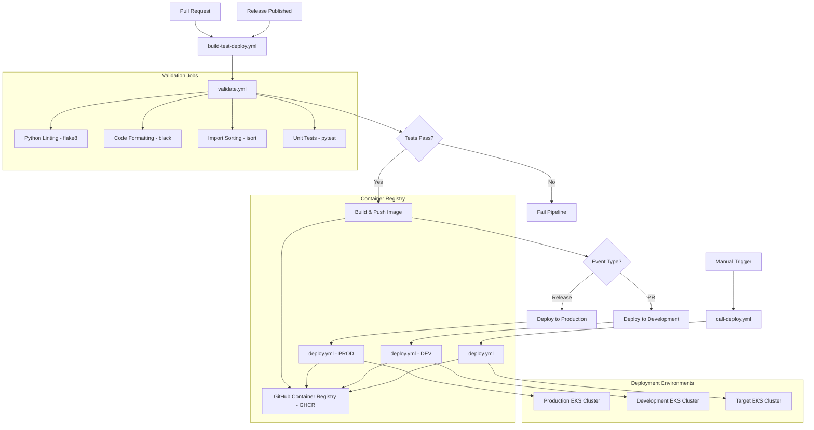

# Ping-Pong Flask Application

This application is created in Python and is meant to test the CICD pipeline to EKS.
It's a simple Flask application that responds to HTTP requests.

## Features

- **GET /ping** - Health check endpoint that responds with "pong"
- **POST /hello** - Receives JSON `{"name":"<name>"}` and responds with `{"message": "Hello <name>, current time is <timestamp>"}`
- **GET /** - Serves an interactive HTML page with API testing capabilities
- **GET /health** - Health check endpoint for Kubernetes probes

### Interactive Web Interface

The home page (`/`) includes an interactive web interface that allows users to:

- **Test all API endpoints** directly from the browser
- **Customize the /hello message** by entering any name
- **See real-time responses** with success/error indicators
- **View formatted JSON responses** for health checks

## Project Structure

```
/
├── .github/workflows/           # GitHub Actions workflows
│   ├── build-test-deploy.yml   # Main CI/CD pipeline
│   ├── call-deploy.yml         # Deployment orchestration
│   ├── cleanup-pr-deployments.yml # PR environment cleanup
│   ├── deploy.yml              # Kubernetes deployment
│   └── validate.yml            # Code validation and testing
├── src/                        # Application source code
│   ├── main.py                 # Main Flask application
│   ├── requirements.txt        # Python dependencies
│   ├── uv.lock                # UV lock file for dependencies
│   ├── Dockerfile             # Container image definition
│   ├── .dockerignore          # Docker ignore file
│   ├── .python-version        # Python version specification
│   ├── Makefile               # Development commands
│   ├── pyproject.toml         # Project configuration
│   ├── pytest.ini            # PyTest configuration
│   ├── test_main.py           # Application tests
│   ├── wsgi.py                # WSGI entry point
│   ├── gunicorn.conf.py       # Gunicorn configuration
│   ├── entrypoint.sh          # Container entrypoint
│   └── html/
│       └── index.html         # Interactive web interface template
├── helm-charts/               # Kubernetes deployment charts
│   ├── create-creds.sh       # Credential creation script
│   ├── deploy.sh             # Deployment script for local testing
│   └── ping-pong/           # Main application chart
│       ├── Chart.yaml        # Helm chart metadata
│       ├── values.yaml       # Default configuration values
│       ├── values-dev.yaml   # Development environment values
│       ├── values-prod.yaml  # Production environment values
│       └── templates/        # Kubernetes resource templates
├── .gitignore               # Git ignore file
├── .pre-commit-config.yaml  # Pre-commit hooks configuration
└── README.md                # This file
```

## Local Development

### Prerequisites
- Python 3.12+
- Docker
- Kubernetes cluster with Helm (for deployment)
- Pre-commit hooks (optional, for development)

### Docker

1. **Build Docker image:**
   ```bash
   cd src && make docker-build
   ```

2. **Run Docker container:**
   ```bash
   cd src && make docker-run
   ```

3. **Test with Docker:**
   ```bash
   cd src && make docker-test
   ```

### Development Tools

#### Pre-commit Hooks

The project includes pre-commit hooks for code quality and consistency:

1. **Install pre-commit:**
   ```bash
   pip install pre-commit
   ```

2. **Install hooks:**
   ```bash
   pre-commit install
   ```

3. **Run manually:**
   ```bash
   pre-commit run --all-files
   ```

The pre-commit configuration includes:
- **Black** - Python code formatting
- **Flake8** - Python linting and style checking
- **isort** - Import statement sorting
- **PyTest** - Automated testing

#### Python Environment

The project uses Python 3.12 and includes:
- **uv.lock** - Dependency lock file for reproducible builds
- **pyproject.toml** - Modern Python project configuration
- **pytest.ini** - Test configuration

## CI/CD Pipeline

The application includes a comprehensive CI/CD pipeline using GitHub Actions with multiple workflows:

### Workflows
#### GitHub Workflow Diagram

The following diagram illustrates how the GitHub Actions workflows interact with each other:



#### Main Pipeline (`build-test-deploy.yml`)
- **Triggers**: Pull requests to main branch, published releases
- **Features**:
  - Runs validation tests
  - Builds and pushes Docker images to GitHub Container Registry (GHCR)
  - Deploys to EKS environments
  - Supports both PR deployments and production releases

#### Code Validation (`validate.yml`)
- **Purpose**: Reusable workflow for testing and validation
- **Includes**:
  - Python dependency caching
  - Code linting with flake8
  - Code formatting check with black
  - Automated testing with pytest
  - Import sorting validation with isort

#### Deployment (`deploy.yml`)
- **Purpose**: Kubernetes deployment to EKS
- **Features**:
  - Environment-specific deployments (dev/prod)
  - Kubectl configuration from secrets
  - Helm chart deployment
  - Health check validation

#### Environment Management
- **`call-deploy.yml`**: Orchestrates deployment calls
- **`cleanup-pr-deployments.yml`**: Cleans up PR-specific deployments

### Container Registry

The pipeline uses GitHub Container Registry (GHCR) for Docker image storage:
- **Registry**: `ghcr.io`
- **Image naming**: `ghcr.io/bruj0/cicd-for-eks/ping-pong`
- **Tagging**: Supports both PR-specific tags and release tags


### Workflow Interaction Details

1. **Triggers**:
   - **Pull Requests**: Automatically trigger the main pipeline for testing and dev deployment
   - **Releases**: Trigger production deployment after successful testing
   - **Manual Dispatch**: Allows manual deployment with custom parameters
   - **Scheduled Cleanup**: Runs daily to clean up stale PR deployments

2. **Reusable Workflows**:
   - **`validate.yml`**: Called by main pipeline for code quality checks
   - **`deploy.yml`**: Called by multiple workflows for actual deployment

3. **Environment Separation**:
   - **Development**: PR-based deployments with branch-specific namespaces
   - **Production**: Release-based deployments with stable configuration

4. **Resource Management**:
   - Automatic cleanup of old PR deployments and container images
   - Prevents resource bloat in both Kubernetes and container registry

## Kubernetes Deployment

The application includes a complete Helm chart for deployment to Kubernetes with AWS Load Balancer Controller support.

### ALB Integration

The Helm chart is configured to use AWS Application Load Balancer (ALB) with automatic hostname assignment:

- **No static hostname required** - The ALB controller automatically assigns a hostname
- **Environment-specific configurations** - Separate values files for dev and prod
- **Health checks** - Configured for ALB health check integration

### Environment-Specific Deployments

The chart includes environment-specific value files:

- **`values-dev.yaml`** - Development environment with debug enabled, lower resources
- **`values-prod.yaml`** - Production environment with SSL, high availability, anti-affinity

### Configuration

The Helm chart supports configuration through `values.yaml`:

- **Replicas:** Number of pod replicas (default: 2)
- **Resources:** CPU and memory limits/requests
- **Ingress:** ALB ingress controller configuration
- **Autoscaling:** Horizontal Pod Autoscaler settings
- **Security:** Pod security context and non-root user

## Environment Variables

- `APP_NAME`: Application name (default: "ping-pong")
- `PORT`: Server port (default: 5000)
- `HOST`: Server host (default: "0.0.0.0")
- `DEBUG`: Debug mode (default: false)

## Production Considerations

- Application runs with gunicorn in production
- Uses non-root user (UID 1001) for security
- Includes health checks and probes
- Supports horizontal pod autoscaling
- Configured for AWS ALB ingress controller
- Includes resource limits and requests
